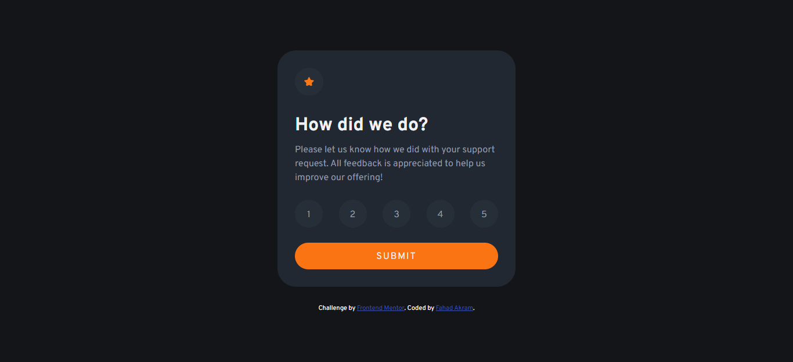
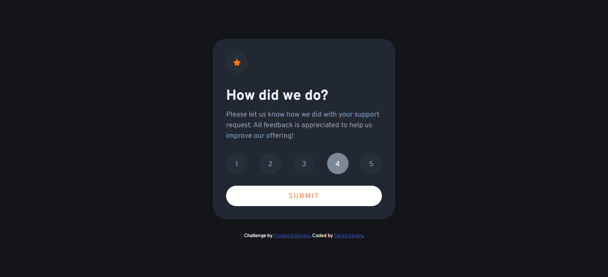
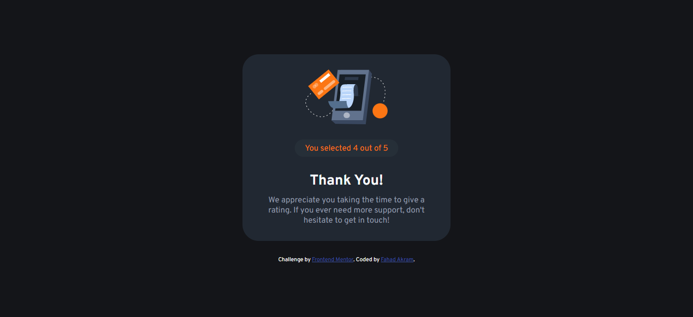

# Frontend Mentor - Interactive rating component solution

This is a solution to the [Interactive rating component challenge on Frontend Mentor](https://www.frontendmentor.io/challenges/interactive-rating-component-koxpeBUmI). Frontend Mentor challenges help you improve your coding skills by building realistic projects. 

## Table of contents

- [Overview](#overview)
  - [The challenge](#the-challenge)
  - [Screenshot](#screenshot)
  - [Links](#links)
- [My process](#my-process)
  - [Built with](#built-with)
  - [What I learned](#what-i-learned)
- [Author](#author)

## Overview

### The challenge

Users should be able to:

- View the optimal layout for the app depending on their device's screen size
- See hover states for all interactive elements on the page
- Select and submit a number rating
- See the "Thank you" card state after submitting a rating

### Screenshot



Hover states for interactive elements



Thank you card and see your selected rating



### Links

- Solution URL: [Add solution URL here](https://your-solution-url.com)
- Live Site URL: [https://fadiiileo.github.io/interactive-rating-component/](https://fadiiileo.github.io/interactive-rating-component/)

## My process

### Built with

- Semantic HTML5 markup
- CSS Flexbox
- Javascript DOM
- Mobile-first workflow

### What I learned

The major thing I learned while developing this interactive rating component was to hide a card after pressing a button and showing a new card in its place using Javascript DOM.

```html
<section class="rating-section">
</section>
<section class="thank-you-section">
</section>
```
```js
ratingSection.style.display = 'none';
thankYouSection.style.display = 'flex';
```

## Author

- Frontend Mentor - [@FaDiiiLeo](https://www.frontendmentor.io/profile/FaDiiiLeo)
- LinkedIn - [Fahad Akram](https://www.linkedin.com/in/fahad-akram-88bb9222b/)
- Stack Overflow - [Fahad](https://stackoverflow.com/users/12165302/fahad)